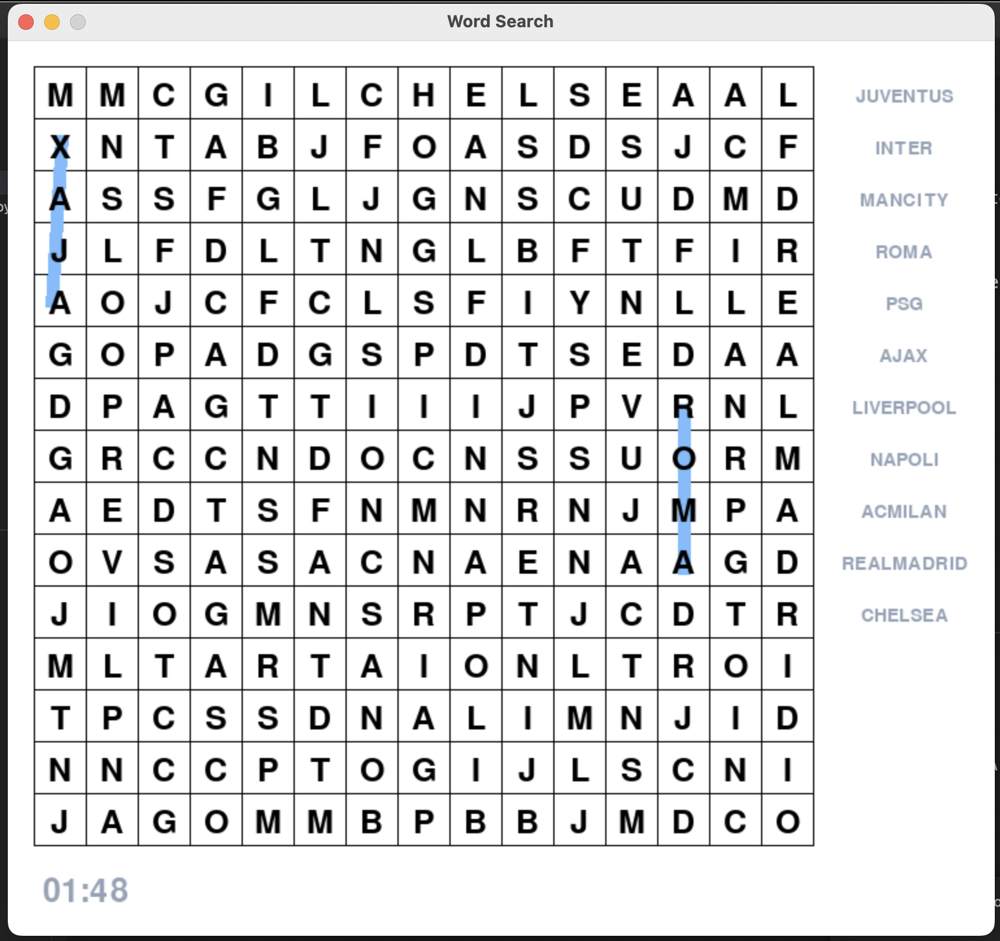

# Word Search Generator
Started on 3/26/2020 6:36 PM, finished on 3/26/2020 8:47 PM.

This program will generate and print a solvable Word Search, using my algorithm to random position them into a 2D array.

> **Word Search Key:** There is a `words = ['Word1', 'Word2'...]` variable in the `wordsearchGenerator.py` file that is used to create the puzzle.



## Usage

```sh
python -m pip install pygame
python3 main.py
```
